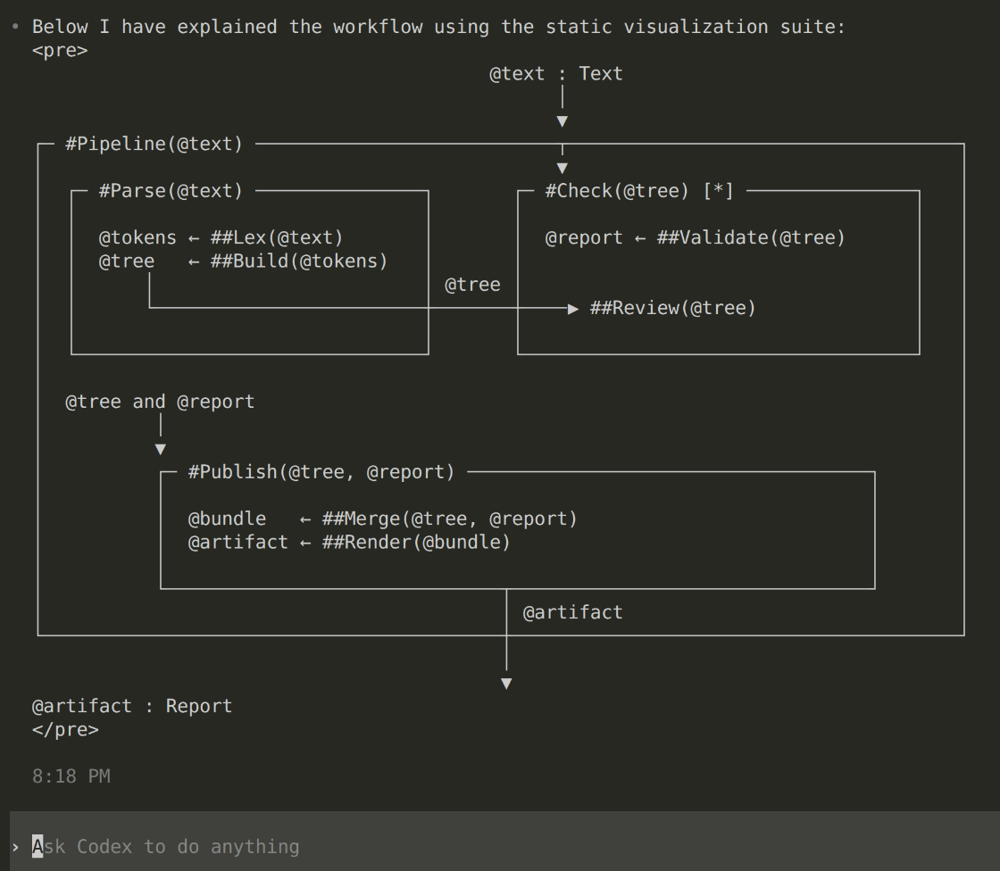

# Workflow Visualization Skill

One **visual language** for your agent to explain different workflows, be it **software**, **mathematical arguments**, **narrative progrssion of scientific documents**, directly in the terminal. The aim is to force your agent speak in **crisp structured diagrams** instead of writing sloppy-long descriptions that will hurt your soul and mind. 





Note that, this skill is used by the agent as a means for communicating and is regenerated whenver the agent wants your attenion on a certain part of the workflow. 

 

## One Selected Grammar 

The current visualization routine uses the following grammar acroos programmig

## Visual grammar across domains

| Symbol | Stable meaning | Programming | Mathematics | Narrative |
|---|---|---|---|---|
| `#Unit(@input)` | A module expanded in the current view. | A function, component, service, or responsibility whose internals are visible. Example: `#Parse(@text)`. | A definition, theorem, lemma, construction, or proof step whose structure is visible. Example: `#Theorem(@assumptions)`. | A section, claim, argument, or reader-facing unit whose role is visible. Example: `#Claim(@evidence)`. |
| `##Unit(@input)` | A relevant child whose internals remain hidden. | A called routine or dependency that has not been opened. | A supporting lemma, definition, or proof step referenced without expansion. | A supporting idea, subsection, example, or qualification referenced without expansion. |
| `###Unit(@input)` | A deeper descendant referenced without opening the intervening levels. | A low-level implementation detail. | A deeper proof dependency or imported result. | A deeper supporting point or source behind the visible argument. |
| `@name` | A stable identity for a reusable object. | Data, configuration, state, input, or result. Example: `@tree`. | A mathematical object, assumption, quantity, or conclusion. Example: `@Hamiltonian`. | A claim, evidence set, reader state, theme, or draft object. Example: `@main-claim`. |
| `@result ← #Unit(@input)` | The value on the right is produced and named on the left. This is assignment, not a spatial arrow. | A function produces a stored result. | A construction or definition produces a named object. | A reasoning or drafting unit produces a named claim, section, or explanation. |
| `A ──▶ B` | A directed relationship from source to destination. | Data flows from producer to consumer. Calls or control flow should be labeled separately. | A definition, assumption, or lemma supports a dependent statement. Label the edge, for example `<used in proof>`. | An idea explains, supports, justifies, or qualifies another unit. Label the rhetorical relation. |
| `┌─ #Composite ─┐` | A boundary containing related units under one local contract. | A subsystem, pipeline, package, or composite operation. | A theorem package, proof region, or scope containing local assumptions. | A section, argument block, or reader journey containing related ideas. |
| `<description>` | A short natural-language description of a role, relation, condition, or status. | `<validates input>` or `<preserve API>`. | `<given: AB=BA>` or `<used in proof>`. | `<why>`, `<qualifies>`, or `<reader exit>`. |
| `: Type` or `(.ext)` | The representation or type of an object, shown when it clarifies a boundary or conversion. | `@report : CheckResult`. | `@H : Hermitian operator`. | `@draft : Markdown (.md)`. |
| `[*]` | Current focus. | The component being inspected or changed. | The result or proof step under discussion. | The claim or section currently being developed. |
| `[x]` | Affected or selected for change; not automatically incorrect. | A module inside the impact cone. | A statement that must be rechecked after a changed assumption. | A passage affected by a structural or rhetorical change. |
| `[!]` | Warning or review required. | An unresolved contract, failure, or risk. | A questionable assumption, unsupported step, or conflicting source. | A claim that may overstate its evidence or confuse the reader. |
| `[?]` | Unknown or unresolved. | Missing implementation evidence or uncertain behavior. | An open hypothesis, unavailable proof, or unknown status. | Missing support, uncertain reader prerequisite, or unresolved framing. |

> `#`, `##`, and `###` describe how much is revealed **in the current view**. They are not permanent hierarchy levels. Likewise, containment, data flow, proof dependence, rhetorical support, and reading order are different relationships and should not share an unlabeled arrow.

Refer to [VISUALIZATION-GRAMMAR.md](VISUALIZATION-GRAMMAR.md) for more details. 


## How to use it ?

### SKILL file 

The shipped Agent Skill is in [SKILL.md](SKILL.md). It gives an agent stable module IDs, recursive disclosure, typed objects, directed relations, and scoped hidden context. Maps appear in ordinary terminal or chat messages. You can edit the [VISUALIZATION-GRAMMAR.md](VISUALIZATION-GRAMMAR.md) as per your requirement and pass it to the agent along with the SKILL.md file.


### Agent handoff

For a direct agentic handoff, point your agent to [AGENT_HANDOFF.md](AGENT_HANDOFF.md) first. It states the public scope, required reading order, task branches, and completion criteria.

### Invocation

Give an agent [SKILL.md](SKILL.md) together with a task, or invoke it explicitly with: `Use $module-map-visuals for this task.`

For default-on communication, merge [integrations/AGENTS.md.snippet](integrations/AGENTS.md.snippet) into the applicable agent instructions. The snippet controls presentation only; it does not grant file access or mutation permission.


## Everyday prompts

- Explain this code and show the relevant callers.
- Map this proof, including hidden assumptions, lemmas, defintions.
- Plan this subsection and show which results support each narrative unit.
- Expand #Parser, show the context of #T1, or use ASCII only at 80 columns.

Configuration is declarative: specify `charset=ascii|unicode`, `width=80`, `expanded_layers=2`, or `detail=compact|normal` in the request. These are prompt conventions, not command-line flags.

See [EXAMPLES.md](EXAMPLES.md) for explanatory notes, [examples/](examples/) for static specimens, [DEMOS.md](DEMOS.md) for self-contained tasks, and [evals/](evals/) for behavioral evaluation records.

## Product boundary

This is a static text skill. It has no worker, viewer, window, pane, hook, event stream, animation, server, browser integration, background process, or runtime dependency.

## Installation and publication

Place the skill folder in a supported user- or project-scoped Agent Skills location after checking that an existing same-name skill will not be overwritten. A folder containing only [SKILL.md](SKILL.md) is sufficient.

After publication, an optional discovery route is:

```sh
npx skills add pafloxy/modular-view-skill --skill module-map-visuals --agent codex
```

This optional installer is not a runtime dependency. Copying the skill folder remains sufficient.

## Evidence and limits

The package fixture suite validates the skill’s structure and static specimens. Behavioral evidence is partial and recorded in [evals/CURRENT_SESSION_SMOKE.md](evals/CURRENT_SESSION_SMOKE.md); remaining cases retain their stated status in [evals/cases.json](evals/cases.json). A geometry check cannot establish that a depicted dependency is true.

## Sources

- [Agent Skills format](https://agentskills.io/specification)
- [Codex skills](https://developers.openai.com/codex/skills/)
- [Codex instructions](https://developers.openai.com/codex/guides/agents-md/)
- [Optional distribution CLI](https://github.com/vercel-labs/skills)

## License

MIT © 2026 Rajarsi Pal. See [LICENSE](LICENSE).
